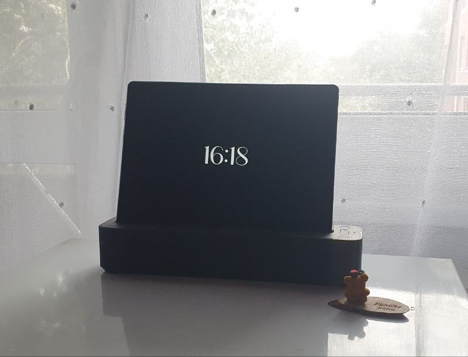

# Lofty Clock Tablet Screensaver

## A stimple, modern clock screensaver developed in Android Studio

This is a personal project, made for my **Lenovo Tablet**. It comes with a dock that acts as a charger/Alexa device when docked (as seen on the picture below). For personal reasons, I have completely disabled the Alexa feature, and wanted to implement a simpler solution for the docking mechanism. 

**As this application was built for personal purposes, it will most definitely not work on your device, but feel free to browse the code.**  

The Application was made using *Android Studio*. 

### Implemented features

 1. When the device is docked, and the application is on, the tablet will automatically connect to the dock speakers via bluetooth
 2.  When the application is open, the screen will remail turned on untill manually locked
 3. The application simply displays a clock. Nice and clean **:)**
 4. When clicked on the screen twice, the application will minimize
 5. When you undock the device, the application closes and disconnects from the bluetooth speaker (the dock)
 6. The app uses a foreground service to keep track of the charging state

### Places for improvement

 1. Automatically launch the app when the device docks
 2. Automatically launch the app when the device is docked and the screen times out or is locked manually

Any help with these features would be greatly appriciated. Feel free to send me an email on tarapogancev@gmail.com if you would like to contribute to this personal project. 
I have already tried a couple of solutions found on the internet, but as none of them work I am unsure how to implement further. 

## Screenshots

